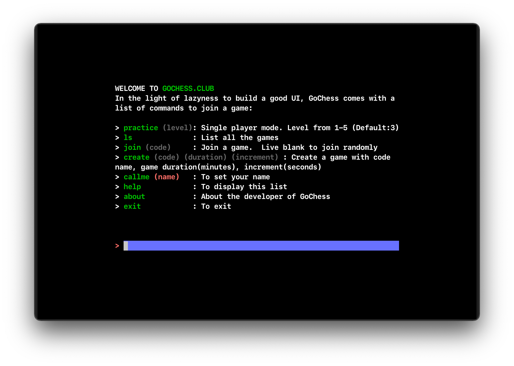
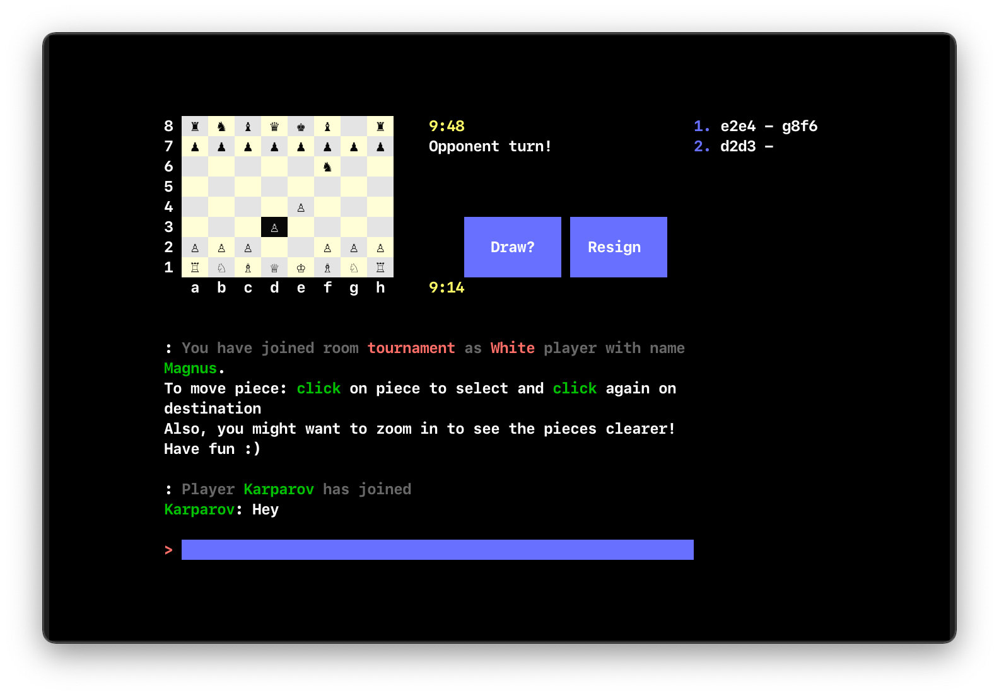

# Chessterm.club
Play chess with your friends on terminal!
# Play
`ssh gochess.club`

# Screenshot
### Menu

### Game play

# Libaries
The following libraries are used to build gochess:
- [notnil/chess](https://github.com/notnil/chess) - Chess engine
- [rivo/tview](https://github.com/rivo/tview) - UI
- [creack/pty](https://github.com/creack/pty) - Pseudo-terminal interfacej
- [gliderlabs/ssh](https://github.com/gliderlabs/ssh) - SSH server
# TODO
- [ ] Single player mode
- [ ] Add timer
- [ ] Hint moves 

# Disclaimer
I'm building this project while learning Go. So any Comments on code quality + logic will be much appricated!
Please add your comment in this [issue](https://github.com/qnkhuat/chessterm/issues/1) if you have any!
